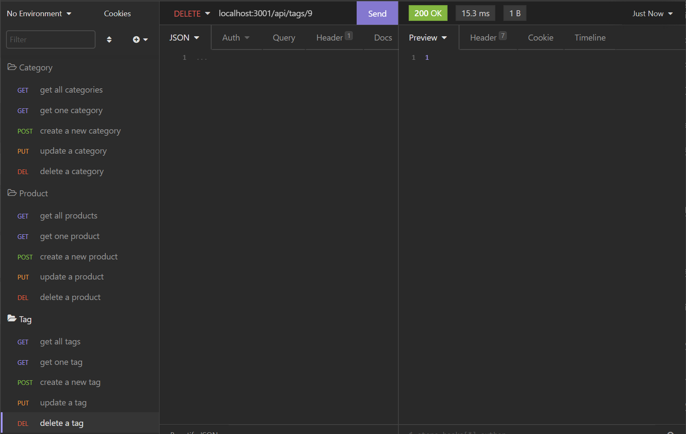

# Sequelized E-commerce Backend

## **The Sequelized based E-commerce Backend**
This program is a simulation of a backend API for an ecommerce website. Consisting of categories, products and their associated tags, we can add and remove items based of their categoires, the actual product, or any tags that may exist in the database

- When the user navigates to the root folder, they must first seed the data with 'npm run seed' followed by typing 'npm start' to initialize the database. 

- Using [Insomnia](https://insomnia.rest/), we can simulate what running the website would look like, while still having access to typical calls of get, post, put and delete all in a single program. 

- We can get all categories , products and tags

- We can get one category, product or tag based on the id

- We can post or create a new category, product or tag, and the id will automatically be added, as well as resolve any associations it has.

- We can update or put data into existing fields for categoriy, product or tag. You can also put partial data such as just updating the name of the product or just the category, and the product will still update, despite the 400 warning.

- Finally, you can also delete a category, product or tag based on its id

# Why it Matters?
Sequelize is a package that allows you to add database functionality through javascript. Using our data, we were able to assign foreign keys through the models index and effectively join the tables together in the routes to get and retrieve the information. Doing this allows us to include and exclude the data we want without having to go into the SQL database and type in specific join functions to parse the data ourselves.

Watch my e-commerce backend in action! 

The e-commerce backend in 2 minutes: [Click here!](https://youtu.be/Xi4irjqwb08)

A detailed overview: [Click Here!](https://youtu.be/M26DxfUt8bU)

## 
We Hope to see you there!
 ##